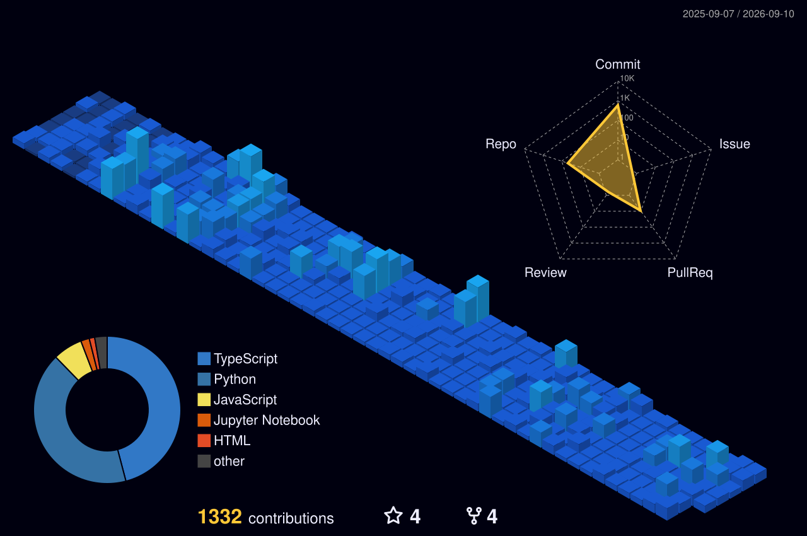

# **Darshan Karthikeya**

  

 

## 👨‍💻 About Me

 **Hi, I'm Darshan!** A passionate **Software Developer** focused on building scalable cloud-native applications, crafting intelligent AI systems, and solving complex problems.

## 💼 Experience

<table>
<tr>
<td width="70%">

 

**💻 Software Engineer Intern** | *QuantaGlobal* | *Jan 2025 - Sep 2025*

- Architected a full-stack SAP Monitoring Platform (React, TypeScript, Node.js, MongoDB) with microservices-oriented backend, delivering real-time tracking across 300+ KPIs via RESTful API design.
- Engineered HireNexa, an AI-powered recruitment platform (LLM APIs, Google Generative AI) with RBAC multi-tenant access control, cutting manual screening effort by 65%.
- Built a reusable React component library (15+ components) across 3 enterprise products; applied memoization, lazy loading, and optimized data-fetching — reducing average API latency by ~35% across 500+ daily production requests.
- Developed HealYou (React Native, iOS/Android) — component architecture, navigation, REST API integration, and JWT authentication workflows.

 

**🤖 AI Research Contributor** | *Viswam.ai (Summer of AI)* | *Jun 2025 - Jul 2025* | *Remote*

- Selected for a nationally competitive program; built NLP preprocessing pipelines (deduplication, normalization, quality validation) for India’s first Telugu LLM at large corpus scale.
- Applied Python-based data engineering workflows including tokenization, text classification, and dataset versioning to prepare structured training corpora for transformer-based language model fine-tuning.

</td>
<td width="30%" align="center">

</td>
</tr>
</table>

## ⚡ Featured Engineering & Innovations

<table width="100%">
  <tr>
    <td width="50%">
      <h3>📈 <a href="https://github.com/karthikeya1220/MarketGlimpse">MarketGlimpse</a></h3>
      
Engineered a comprehensive financial dashboard combining real-time data streaming with generative AI to provide instant, actionable insights on market trends.

      <b>Stack:</b> Next.js • MongoDB • Gemini API
    </td>
    <td width="50%">
      <h3>🎨 <a href="https://github.com/karthikeya1220/UI-Flow">UI-Flow</a></h3>
      
Built an AI-driven development tool that instantly converts raw wireframes and designs into production-ready React/Next.js code components.

      <b>Stack:</b> Next.js • Supabase • OpenRouter
    </td>
  </tr>
  <tr>
    <td width="50%">
      <h3>🤝 <a href="https://github.com/karthikeya1220/HireNexa">HireNexa</a></h3>
      
Architected an intelligent Applicant Tracking System (ATS) that automates resume parsing and semantic candidate matching using Large Language Models.

      <b>Stack:</b> MERN • Next.js • Gemini API
    </td>
    <td width="50%">
      <h3>💼 <a href="https://github.com/karthikeya1220/Get-It">Get-It</a></h3>
      
Developed a campus-centric freelance marketplace equipped with integrated secure payments and smart matching algorithms for college students.

      <b>Stack:</b> Next.js • Firebase • Razorpay
    </td>
  </tr>
  <tr>
    <td width="50%">
      <h3>🌐 <a href="https://github.com/karthikeya1220/Developers-Club-IIITDM">Developers Club IIITDM</a></h3>
      
Led the development of the official institutional platform for the Developers Club, featuring interactive 3D elements and optimized student engagement flows.

      <b>Stack:</b> Next.js • Three.js • Tailwind CSS
    </td>
    <td width="50%">
      <h3>🏥 <a href="https://github.com/karthikeya1220/HealYou">HealYou</a></h3>
      
Created a cross-platform mobile application combining social networking with fitness tracking to encourage community-driven wellness and accountability.

      <b>Stack:</b> React Native • Expo • Node.js
    </td>
  </tr>
</table>

## 🛠️ Tech Stack & Capabilities

### 💻 Languages

 
Python • TypeScript • JavaScript • C • C++
  

### 🧠 AI & Machine Learning

 
Generative AI • RAG • LangChain • HuggingFace • MLOps • LLMs
  

### ⚙️ Backend Architecture

 
Microservices • REST APIs • WebSockets • JWT • OAuth 2.0
  

### 🗄️ Databases & Data

 
Schema Design • Query Optimization • Vector Search
  

### 🌐 Frontend & UI

 
Responsive Design • UI/UX • State Management
  

### ☁️ Cloud & DevOps

 
CI/CD Pipelines • Agile/Scrum • TDD (Jest)

## 🏆 Achievements

| Achievement | Details |
| :--- | :--- |
| 📝 **IEEE Publication** | Research paper accepted at **TENCON 2026** (Bali): *"Impact-Guided Slice Selection for Efficient Human-in-the-Loop Brain Tumor Segmentation"* (NeuroSlice). |
| 🥇 **Hackathon Champion** | **1st place** at BugByte '25 & RetroRevamp '25; **Top 5** out of 106 teams at VIT Hackathon. |
| 👨‍💻 **Lead Software Developer** | Built the official IIITDM Placement Portal serving **500+ students** and **30+ recruiters**. |
| 🚀 **Technical Lead** | Led development of the official IIITDM CSE Department website and Developers Club platform. |
| 💻 **Head Core (Tech Affairs)** | Coordinated technical planning, code reviews, and mentored developers across institute platforms. |
| 🤖 **Summer of AI '26** | Selected to contribute to Viswam.ai's Telugu LLM initiative and AI product development. |

## 📊 GitHub Stats

 

### 📈 Contribution Graph

 

## 🎯 Currently

- 🔭 Building scalable backend microservices and distributed systems
- 🌱 Exploring **AI/ML integration** in web apps
- 👯 Contributing to **open-source projects**
- 💬 Mentoring in **full-stack development**

---

**Let's build something amazing together!** 🚀

